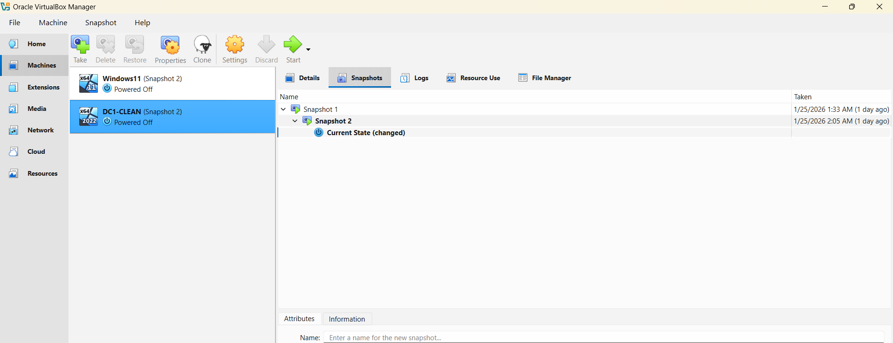
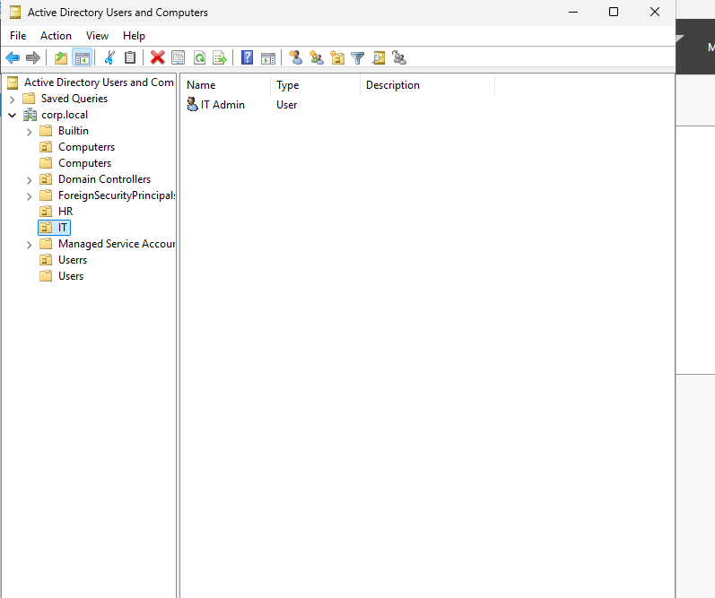
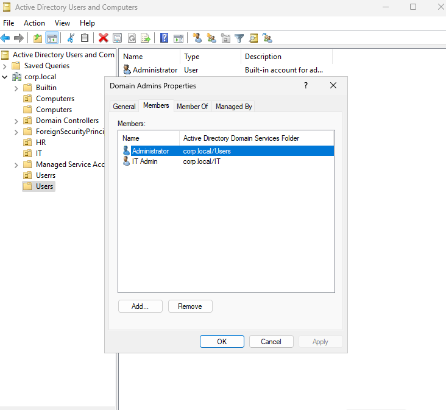

# active-directory-home-lab
Windows Server Active Directory home lab with DNS, OUs, users, and admin roles

## Overview
This project demonstrates the installation and configuration of a Windows Server Active Directory environment.
The lab was built to gain hands-on experience with domain services, DNS, and user administration.

## Technologies Used
- Windows Server 2022
- Active Directory Domain Services (AD DS)
- DNS
- Oracle VirtualBox

## Lab Objectives
- Install Windows Server
- Promote the server to a Domain Controller
- Configure DNS
- Create Organizational Units (OUs)
- Create users and security groups
- Assign Domain Admin privileges
- Verify Active Directory functionality

## Network Configuration
- Static IP Address
- Host-only networking
- Domain name: `corp.local`

## Key Skills Demonstrated
- Active Directory administration
- User and group management
- Role-based access control
- Troubleshooting and recovery using snapshots

## Screenshots
Screenshots of key steps are included in the `screenshots` folder.

## Documentation
Step-by-step setup notes are available in the `steps` folder.

## Lab Walkthrough with Screenshots

### Step 1: Virtual Machine Setup

Configured Windows Server 2022 in VirtualBox, set a static IP address, and renamed the server.

---

### Step 2: Organizational Unit (OU) Creation

Created Organizational Units (HR, IT) to organize users and computers in Active Directory.

---

### Step 3: Domain Admin Configuration

Added the IT Admin user to the Domain Admins security group.

---

### Step 4: User Container Verification

Verified the default Users container and confirmed user account placement.

## What I Learned

- Built and configured a Windows Server 2022 Active Directory environment
- Created and managed Organizational Units (OUs) for users and computers
- Assigned Domain Admin privileges and verified role-based access
- Strengthened troubleshooting skills by validating configurations step-by-step
- Documented technical work clearly using GitHub and Markdown
