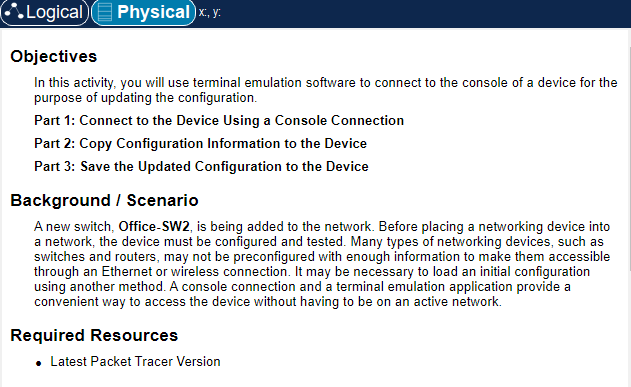
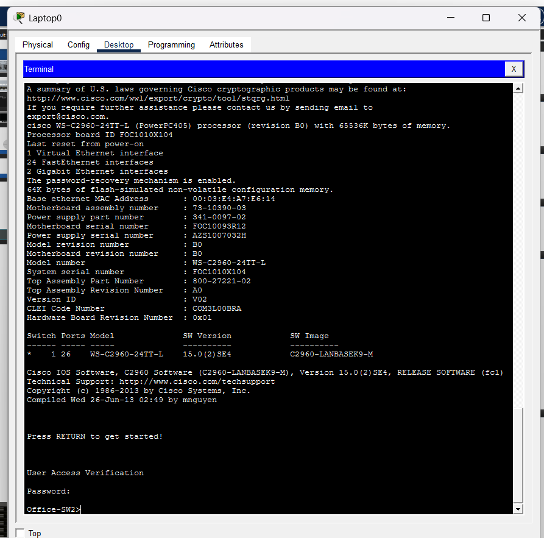
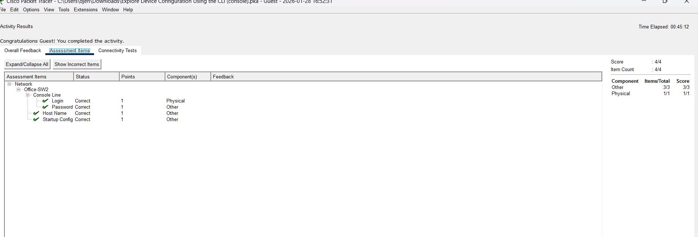

# Packet Tracer – Explore Device Configuration Using the CLI

## Overview
This lab demonstrates accessing and exploring a Cisco switch using the command-line interface (CLI) via a console connection in Cisco Packet Tracer.

## Objectives
- Connect to a switch using a console cable
- Access the device CLI
- View device configuration information
- Save the configuration

## Tools Used
- Cisco Packet Tracer
- Cisco Switch (2960)
- Console connection

## Screenshots
Screenshots below show the lab instructions, successful completion, and CLI output.

### Lab Instructions

### CLI Output

### Successful Completion

